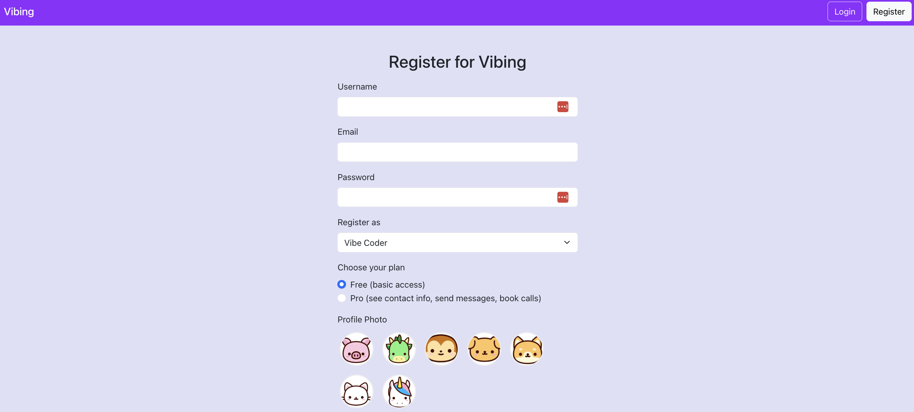
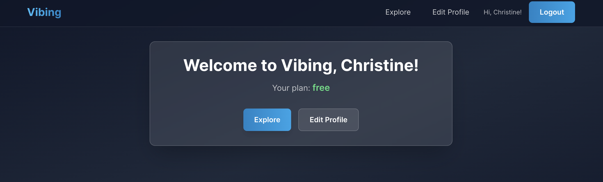

# Vibing

A full-stack web platform connecting vibe coders with domain experts, featuring a modern high-tech UI built with advanced styling technologies.

## UI Evolution: From Basic to High-Tech

### Original UI (Built with Cursor IDE)
The initial frontend was developed using Cursor IDE with React Bootstrap for basic functionality:



**Original Tech Stack:**
- React 18 with Bootstrap 5.3.3
- Basic form styling and layouts
- Standard Bootstrap components
- Light theme with purple accents

### Advanced UI (Enhanced with Claude Code)
The UI was completely redesigned using Claude Code to create a premium, high-tech experience:



**New Advanced Tech Stack:**
- **Tailwind CSS 3.4** - Utility-first CSS framework for rapid UI development
- **Glassmorphism Design** - Semi-transparent elements with backdrop blur effects
- **Dark Theme Architecture** - Professional dark color scheme with gradient backgrounds
- **Interactive Animations** - Hover effects, scaling, and smooth transitions (300ms duration)
- **Advanced Color System** - Custom color palette with opacity variants and glow effects
- **Responsive Grid System** - Mobile-first design with adaptive layouts
- **Custom Components** - Glass cards, tech buttons, and modern form inputs

**Key UI Improvements:**
- 🎨 **Glassmorphism Effects**: Semi-transparent cards with backdrop blur
- 🌙 **Dark Theme**: Professional dark gradient backgrounds
- ✨ **Interactive Elements**: Hover animations, glow effects, and scaling
- 🎯 **Modern Typography**: Enhanced font hierarchy and spacing
- 📱 **Responsive Design**: Optimized for all screen sizes
- 🔄 **Smooth Transitions**: 300ms animations throughout the interface
- 💫 **Loading States**: Animated spinners and progress indicators

## Architecture Overview

### Backend (Flask)
- **Framework**: Flask with SQLAlchemy ORM
- **Database**: SQLite (production-ready with Docker deployment)
- **Authentication**: JWT tokens via flask_jwt_extended
- **Security**: Bcrypt password hashing, CORS enabled
- **Email Integration**: Gmail SMTP for user communication

### Frontend (React + Tailwind)
- **Framework**: React 18 with modern hooks
- **Styling**: Tailwind CSS with custom design system
- **State Management**: React useState hooks
- **Routing**: Single-page application with conditional rendering
- **API Integration**: Fetch API with proxy configuration

### Deployment
- **Containerization**: Docker with multi-stage builds
- **Orchestration**: AWS ECS support (Fargate/EC2)
- **Reverse Proxy**: Nginx with API proxying for seamless frontend/backend communication
- **Environment**: Development and production configurations
- **New UI Deployment**: Special Docker images tagged `latest-new-ui` for the advanced interface

## Local Development Setup

### 1. Backend (Flask)

```sh
cd backend
python3 -m venv venv
source venv/bin/activate
pip install -r requirements.txt
```

- Create a `.env` file in `backend/` with:
  ```
  SECRET_KEY=supersecretkey
  JWT_SECRET_KEY=jwtsecretkey
  EMAIL_ADDRESS=your_gmail@gmail.com
  EMAIL_PASSWORD=your_gmail_app_password
  ```

- Run the backend:
  ```sh
  export FLASK_APP=app.py
  flask run
  ```
  (API at http://127.0.0.1:5000/)

### 2. Frontend (React)

```sh
cd frontend
npm install
npm start
```
(App at http://localhost:3000/)

## Docker Deployment with New UI

### Quick Start with Enhanced UI
To run the application with the new advanced UI using Docker:

```sh
# Run the enhanced UI deployment
bash deployment/run_local_new_ui.sh
```

This will start:
- **Backend**: `http://localhost:5000` (API endpoints)
- **Frontend**: `http://localhost:8080` (New high-tech UI)

### Manual Docker Commands
If you prefer to run the containers manually:

```sh
# Create network
docker network create vibing-net || true

# Run backend
docker run -d --rm \
  --name vibing-backend-new-ui \
  --network vibing-net \
  -p 5000:5000 \
  vibing-backend:latest-new-ui

# Run frontend  
docker run -d --rm \
  --name vibing-frontend-new-ui \
  --network vibing-net \
  -p 8080:80 \
  vibing-frontend:latest-new-ui
```

### Building the Enhanced UI Images
To rebuild the Docker images with the latest changes:

```sh
# Build backend
docker build -f deployment/Dockerfile.backend -t vibing-backend:latest-new-ui .

# Build frontend with new UI
docker build -f deployment/Dockerfile.frontend.new-ui -t vibing-frontend:latest-new-ui .
```

**Key Features of the Docker Deployment:**
- 🔗 **Nginx Proxy**: Seamless API routing from frontend to backend
- 🌐 **Network Isolation**: Containers communicate via Docker network
- 🚀 **Production Ready**: Multi-stage builds for optimized images  
- 🔄 **Hot Deployment**: Easy container restart and updates

---

## Testing & Resetting the App

- To test from scratch (reset all data):
  1. Stop the backend server (Ctrl+C).
  2. Delete the database file:
     ```sh
     rm backend/vibing.db
     ```
  3. Restart the backend:
     ```sh
     cd backend
     source venv/bin/activate
     flask run
     ```
  4. The app will start with a fresh database (no users or data).

- You can now register, login, and test all features as a new user.

---

## Local Testing Automation

You can use the `local_test.sh` script (in the project root) to automate local setup, reset, and launch for development and testing.

### Usage

```sh
./local_test.sh [step]
```

- If no argument is given, the script will:
  - Set up backend venv and install requirements
  - Install frontend npm dependencies
  - Erase the backend database
  - Launch backend and frontend servers

- You can also run individual steps:
  - `backend_env`     — Setup backend venv and install requirements
  - `frontend_env`    — Install frontend npm dependencies
  - `erase_db`        — Remove backend/vibing.db (reset database)
  - `launch_backend`  — Start backend Flask server
  - `launch_frontend` — Start frontend React server

Example: To just reset the database and relaunch backend:
```sh
./local_test.sh erase_db
./local_test.sh launch_backend
``` 